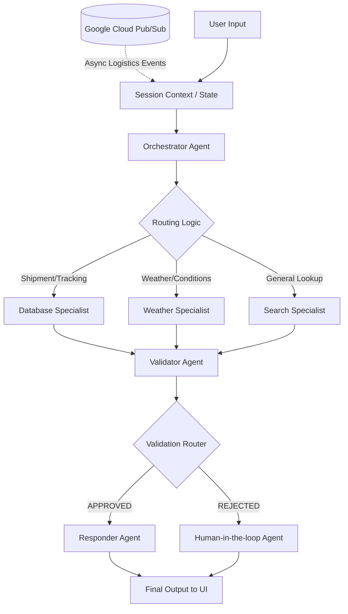

# 🚚 Logistics Agent: Intelligent Supply Chain Assistant

A robust, multi-agent conversational AI system designed to streamline logistics operations. This project leverages the **Google Agent Development Kit (ADK)** and **Gemini** to understand natural language queries, interact with relational databases, monitor external conditions like weather, and provide real-time tracking insights to users. 

Built as a comprehensive portfolio project, it demonstrates advanced LLM orchestration, tool use, validation guardrails, and asynchronous event handling.

---

## ✨ Key Features

- **Multi-Agent Orchestration:** A sophisticated workflow that routes user queries to specialized agents (Database, Weather, Web Search) based on intent.
- **Natural Language to SQL:** Uses the **Model Context Protocol (MCP)** to securely translate natural language questions into database queries to fetch live shipment and location data.
- **External Intelligence Integration:** Integrates real-time weather APIs to alert users about meteorological risks on specific shipment routes.
- **Validation & Guardrails:** Includes a dedicated Validator Agent to ensure responses are accurate, safe, and do not leak internal system prompts or raw SQL.
- **Human-in-the-Loop Escalation:** Automatically routes rejected or highly sensitive queries to a human intervention fallback.
- **Real-Time Event Ingestion:** Connects to **Google Cloud Pub/Sub** to ingest asynchronous logistics events and inject them into the agent's context.
- **Streaming Chat UI:** A responsive, interactive frontend built with **Streamlit**, featuring real-time token streaming and system note inspection.
- **Full Observability:** Instrumentations using **OpenTelemetry** for deep tracing of agent reasoning and tool execution times.

---

## 🏗️ System Architecture

The application is built on a directed graph workflow where different agents handle specific responsibilities:



### 🧩 Core Components

1. **`main.py`**: The FastAPI backend entry point that serves the ADK workflow using Uvicorn.
2. **`streamlit_app.py`**: The interactive chat UI that communicates with the backend via Server-Sent Events (SSE) for streaming responses.
3. **`my_agent/agent.py`**: Defines the primary ADK `Workflow`, linking orchestrators, specialists, routers, and validators.
4. **`my_agent/tools/`**:
   - `database.py`: Uses `MCPToolset` to connect to a **Google Cloud SQL** (MySQL) database using the `@benborla29/mcp-server-mysql` MCP server package.
   - `weather.py`: An HTTP-based tool to fetch real-time weather data (`wttr.in`) with built-in caching.
   - `pubsub.py`: Connects to GCP Pub/Sub to pull pending asynchronous notifications.

---

## 🛠️ Technology Stack

- **Core Framework:** Google ADK (`google-adk`), Google GenAI
- **Backend:** Python, FastAPI, Uvicorn
- **Frontend:** Streamlit
- **Database:** Google Cloud SQL connected via MCP (Model Context Protocol) 
- **Cloud & Eventing:** Google Cloud Pub/Sub
- **Observability:** OpenTelemetry (OTLP Exporter)
- **Environment Management:** `python-dotenv`

---

## 🚀 Getting Started

### Prerequisites
- Python 3.10+
- Node.js (for the MCP MySQL server)
- A **Google Cloud SQL** Database instance (MySQL)
- Google Cloud Project with Pub/Sub enabled (optional but recommended for full functionality)

### Installation

1. **Clone the repository and install dependencies:**
   ```bash
   python -m venv .venv
   source .venv/bin/activate  # On Windows: .venv\Scripts\activate
   pip install -r requirements.txt
   ```

2. **Set up Environment Variables:**
   Create a `.env` file in the `my_agent/` directory with your database and GCP credentials:
   ```env
   DB_HOST=localhost
   DB_PORT=3306
   DB_USER=root
   DB_PASS=password
   DB_NAME=logistics_db
   GCP_PROJECT_ID=your-project-id
   PUBSUB_SUBSCRIPTION_ID=your-sub-id
   ```

3. **Install the MCP Server for Cloud SQL (if not globally installed):**
   ```bash
   npm install -g @benborla29/mcp-server-mysql
   ```

### Running the Application

You will need to run the backend and frontend in separate terminal windows.

**Terminal 1: Start the ADK Backend**
```bash
python main.py
# Alternatively: adk web
```
*The backend will start on `http://localhost:8000`.*

**Terminal 2: Start the Streamlit UI**
```bash
streamlit run streamlit_app.py
```
*The web interface will automatically open in your browser.*

---

## 💡 Example Queries

Try these queries in the Streamlit interface to test the routing and tools:
- *"What is the status of shipment TRK-FLGA-001?"* (Routes to Database Specialist)
- *"Are there weather alerts on the Miami to Atlanta route?"* (Routes to Weather Specialist)
- *"Show me all delayed shipments."* (Routes to Database Specialist)
- *"What carriers are active today?"* (Routes to Database Specialist)
